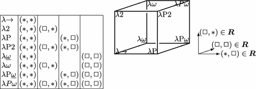
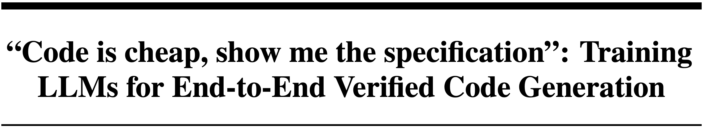

## Me in College

<reveal>
- If you know what this is: I'm sorry for your trauma

---

## At MSR

<reveal>
- Got into AI with a bias. "At least I'll learn Linux kernel internals"

<reveal>
- Ended up loving it

---

## Code Researcher

An agent that can automatically resolve crashes in the Linux kernel.

<reveal>
- New SOTA everyday on SWE-bench, but gains didn't translate to large systems codebases.

<reveal>
- Challenges:
    - Iterative edit-and-test approach not feasible (~1h build time)
    - Very large (>75K files, >20M LoC) & complex (concurrency, kernel invariants etc.)
    - Rich development histories (>1M commits, >20 years, >1K contributors)

## Deep Research Agent for Code

Inspired by web deep research, we created a 3-step pipeline:

<reveal>
1. **Analysis**: Start from the crash report, iteratively reason and call tools to gather more context.
    - 3 tools: `search_definition(sym)`, `search_code(regex)` and `search_commits(regex)`. 3 reasoning strategies.
    - First coding agent to explicitly analyse the historical evolution of the codebase.

<reveal>
2. **Synthesis**: Filter out irrelevant parts of the gathered context, then generate a patch to fix the crash

<reveal>
3. **Validation**: apply the patch and check if the kernel still crashes.

## Results

\begin{table}[t]
\centering
\caption{Crash resolution rate (CRR) on the kBenchSyz benchmark ($200$ bugs).
}
\label{tab:rq1-main}
\vspace*{-2mm}
\scalebox{0.95}{
\begin{tabular}{ccccc}
\cmidrule{1-5}
\textbf{Setting} & \textbf{Tool} & \textbf{Max calls}& \textbf{P@k} & \textbf{CRR (\%)} \\
\cmidrule{1-5}
\multirow{3}{*}{\rotatebox[origin=c]{0}{\centering Assisted}} 
  & GPT-4o           & $1$ & P@$5$ & $36.00$ \\
  & o1                       & $1$ & P@$5$  & $51.00$ \\
  & CrashFixer~(Gemini 1.5 Pro-002) & $\geq 4$ & P@$16$ & $49.22$ \\
  & CrashFixer~(Gemini 2.5 Pro) & $\geq 4$ & P@$16$ & $\mathbf{70.00}$ \\
\cmidrule{1-5}
\multirow{3}{*}{\rotatebox[origin=c]{0}{\centering Unassisted}} 
  & Agentless (GPT-4o) & $4$ & P@$5$  & $31.00$ \\
  & SWE-agent (GPT-4o) & $15$ & P@$5$  & $31.50$ \\
  & \textbf{\cresearcher{} (GPT-4o)} & $15$ & P@$5$  & $48.00$ \\
  & \textbf{\cresearcher{} (GPT-4o + o1)} & $15$ & P@$5$  & $58.00$ \\
  & \textbf{\cresearcher{} (Gemini 2.5-Flash)} & $15$ & P@$5$  & $\mathbf{67.00}$ \\
\cmidrule{1-5}
\end{tabular}
}
\end{table}

- Matches or beats the best *Assisted* (i.e., files to be edited are given) setting tools
- Outperforms the top SWE-bench approaches by a large margin

## Learnings

<reveal>
- Simple, scalable tooling goes a long way
    - Just `ctags`, `git log` and `git grep` can solve 67% of kernel crashes!

<reveal>
- Context, Context, Context, ... (120 times)
    - Context determines performance ceiling
    <!-- - Includes files to edit **and** additional global context -->

<reveal>
- Commit history is useful!
    - ~10% drop in performance without it

## End-to-End Verified Code Generation

<greyed> (The title was my idea)

## Trusting Code without Reading It

- Everyone's writing code. Is anyone reading it?

- How do you trust the code then?

<reveal>
- Enter *formal verification* \glitteremoji
    - Read the specification, let a verifier check the code

<problem text box titled End-to-End Verified Code Generation>
Given your natural language intent, an LLM outputs a formal **specification**, **code** and a verifier-checked **proof** that the code aligns with the specification.

## Training Pipeline

- Work with the Verus verifier for Rust

- Construct NL descriptions from Verus programs

- Use masking modes to teach the model to write spec, code, proof (and different combinations)

- SFT stage + RL stage

## Preliminary Results

\begin{table}[t]
\centering
\caption{%
 Results measuring proof writing, spec writing, and end-to-end verified code generation performance.
}
\label{tab:leaderboard}
\scriptsize
\setlength{\tabcolsep}{3.5pt}
\begin{tabular}{l rr rrr rr rr}
\toprule
& \multicolumn{2}{c}{\textbf{VeruSage-Bench (849)}}
& \multicolumn{3}{c}{\textbf{SpecBench (97)}}
& \multicolumn{2}{c}{\textbf{VTB-XS (99)}}
& \multicolumn{2}{c}{\textbf{VerifyThisBench (41)}} \\
\cmidrule(lr){2-3}\cmidrule(lr){4-6}\cmidrule(lr){7-8}\cmidrule(lr){9-10}
\textbf{Model}
  & Hands-On\% & Plain-Harness\%
  & S1\% & S2\% & \makecell{S3\\Score}
  & Verified\% & Coherent\%
  & Verified\% & Coherent\% \\
\midrule

\rowcolor{lightgreen}
Qwen3-4B (Inst.)            &  3.30 &  1.30 &  2.06 & 1.03 & 0.80 &  3.03 &  3.03 &  0.00 & 0.00 \\

\midrule

PSV-Verus (3B-Inst.)        &  0.24 &  0.12 &  0.00 & 0.00 & ---  &  8.08 &  2.02 &  0.00 & 0.00 \\
Qwen-VeruSyn (32B-Inst.)    & 14.96 & 13.55 &  2.06 & 2.06 & ---  & 14.14 & 11.11 &  7.32 & 0.00 \\
Kimi-K2.5                   & \textbf{41.58} & \textbf{41.22} & \textbf{19.59} & \textbf{9.28} & \textbf{9.68} & 43.43 & \textbf{42.42} &  2.44 & \textbf{2.44} \\

\midrule

\rowcolor{lightpurple}
\textbf{VerusLM-4B-Codex-SFT}                 &  1.30 &  9.07 &  0.00 & 0.00 & ---  &  6.06 &  2.02 & 65.85 & \textbf{2.44} \\

\rowcolor{lightpurple}
\textbf{VerusLM-4B-Codex}           &  7.66 &  7.42 &  4.12 & 0.00 & 3    & \textbf{46.46} & 5.05 & \textbf{75.61} & 0.00 \\

\bottomrule
\end{tabular}
\end{table}

- Still training, turns out this is quite hard
- Match Kimi at end-to-end verified code generation and get decent gains over the base model.

##

Thank You MSR!